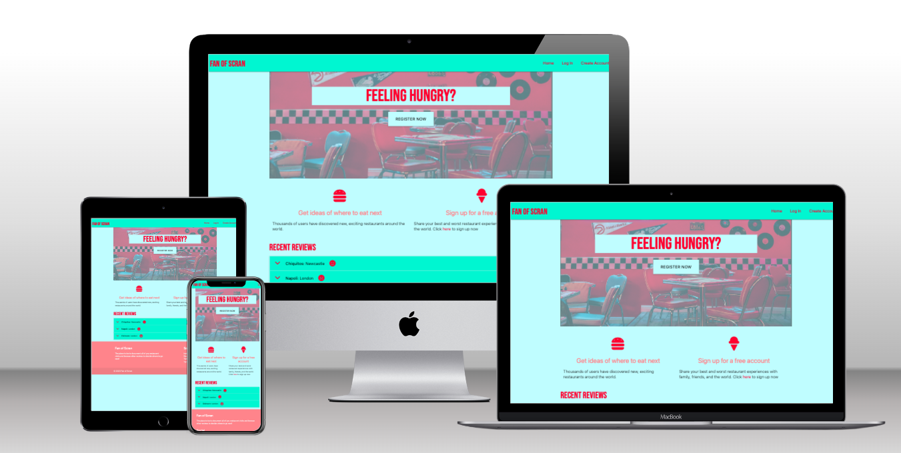

## Fan of Scran

[Link to live website](https://ms3-b.herokuapp.com/)

---

## **About**

**Milestone 3 project - Back End Development - Code institute**

Fan of Scran is a website for lovers of dining out. Users can browse reviews and upload their own reviews of their restaurant experiences

---

## Table of Contents
- [User experience (UX)](#ux)     
    - [User stories](#user-stories)
    - [Strategy](#strategy)
    - [Scope](#scope)
    - [Structure](#structure)
    - [Skeleton](#skeleton)
    - [Surface](#surface)
- [Features](#features)
- [Technologies used](#technologies-used)
- [Testing](#testing)
- [Deployment](#deployment)
- [Credits](#credits)

---

## **UX**

User experience

### **User stories**

### **As a new user I want ...**
- To understand what the sites purpose is immediatley.
- To be able to navigate to and use the registration page easily.
- To easily navigate the site once logged in and start adding reviews.

### **As a returning user I want ...**
- To be able to view my own restaurant reviews in order of when I made them.
- To edit and delete my own reviews.
- To search reviews by restaurant name, location, and user.
- To see most the latest reviews on the home page.

### **As the site owner I want ...**
- To be able to login with an admin account and delete any reviews incase they are inappropriate or offensive
- To attract new users and retain existing users to create a site with more reviews 
- Provide 404 and 500 error pages to redirect users back to the homepage
- Any external links (e.g. to our social media sites) to open in a new tab
- Provide a secure registration/login for users

---

### Strategy
The following questions were asked when developing a strategy...
- Who is the target audience, and is it culturally appropriate?
    - The target audience is anyone who loves to dine out and either document their review of this for themselves/friends/strangers or simply browse others reviews to get inspiration for where to eat next. 
- Is the technology appropriate for the user and the purpose of the website?
    - The technology is intuitive and straightforward to allow users to quickly add and browse reviews.
- How is the offering of this site different from competitors?
    - You can add a review of any restaurant in the world, even if it hasn't been reviewed before.

From the above questions, the focus for the strategy will be on the following:
- Develop a site that where the purpose is immediatley clear, and it is simple to sign up.
- Ensure the technology is straightforward and relevant to the target audience.
- Increase return users back to the site, by displaying latest reviews so they can check in regularly to see whats new.

---

### Scope
The scope of this website is to provide...
- Secure registration and login
- Straightforward navigation around the site
- Clear forms to fill out to add new reviews, with validation included.
- A search feature to allow users to filter specific reviews
- A cuisine page to allow users to browse reviews of specific cuisines

---