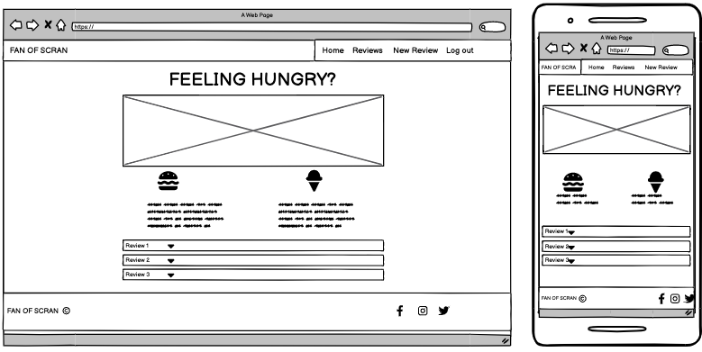
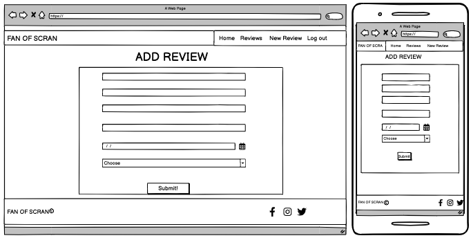
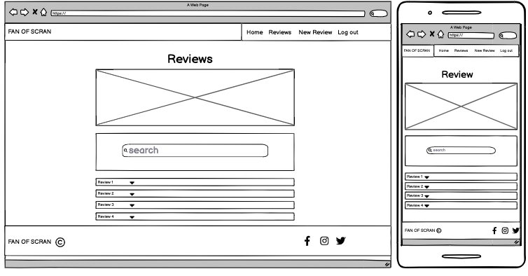
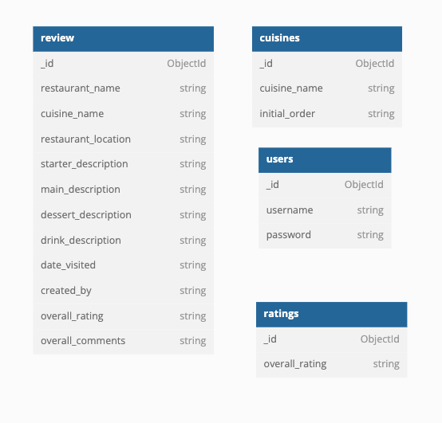
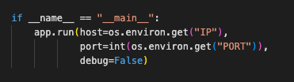
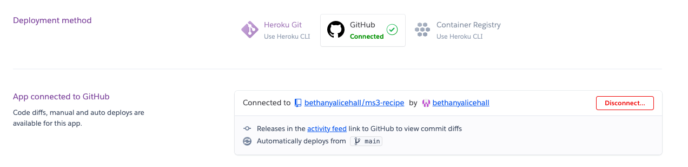

## Fan of Scran

[Link to live website](https://ms3-b.herokuapp.com/)

---

## **About**

**Milestone 3 project - Back End Development - Code institute**

Fan of Scran is a website for lovers of dining out. Users can browse reviews and upload their own reviews of their restaurant experiences. For the website name, "scran" is northern dialect, used as a word for food.

### Project Focus
The goal of this project is for the user to be able to create, read, update and delete (CRUD) restaurant reviews.

---

## Table of Contents
- [User experience (UX)](#ux)     
    - [User stories](#user-stories)
    - [Strategy](#strategy)
    - [Scope](#scope)
    - [Structure](#structure)
    - [Skeleton](#skeleton)
    - [Surface](#surface)
- [Features](#features)
- [Technologies used](#technologies-used)
- [Testing](#testing)
- [Deployment](#deployment)
- [Credits](#credits)

---

## **UX**

User experience

### **User stories**

### **As a new user I want ...**
- To understand what the sites purpose is immediatley.
- To be able to navigate to and use the registration page easily.
- To easily navigate the site once logged in and start adding reviews.

### **As a returning user I want ...**
- To be able to view my own restaurant reviews in order of when I made them.
- To edit and delete my own reviews.
- To search reviews by restaurant name, location, and user.
- To see the latest reviews on the home page.

### **As the site owner I want ...**
- To be able to login with an admin account and delete any reviews incase they are inappropriate or offensive
- Provide 404 and 500 error pages to redirect users back to the homepage
- Any external links (e.g. to our social media sites) to open in a new tab
- Provide a secure registration/login for users
- To attract new users and retain existing users to create a site with more reviews 

---

### Strategy
The following questions were asked when developing a strategy...
- Who is the target audience, and is it culturally appropriate?
    - The target audience is anyone who loves to dine out and either document their review of this for themselves/friends/strangers or simply browse others reviews to get inspiration for where to eat next. 
- Is the technology appropriate for the user and the purpose of the website?
    - The technology is intuitive and straightforward to allow users to quickly add and browse reviews.
- How is the offering of this site different from competitors?
    - You can add a review of any restaurant in the world, even if it hasn't been reviewed before.

From the above questions, the focus for the strategy will be on the following:
- Develop a site that where the purpose is immediatley clear, and it is simple to sign up.
- Ensure the technology is straightforward and relevant to the target audience.
- Increase return users back to the site, by displaying latest reviews so they can check in regularly to see whats new.

---

### Scope
The scope of this website is to provide...
- Secure registration and login
- Straightforward navigation around the site
- Clear forms to fill out to add new reviews, with validation included.
- A search feature to allow users to filter specific reviews
- A cuisine page to allow users to browse reviews of specific cuisines

---

### Structure
The website is organised by a hierarchical tree structure. This is a standard structure used commonly, and it reduces complexity. This structure can sometimes provide problems in regards to the navigation bar when displayed on mobile devices, however including the burger toggle bar, solves this. 

#### The structure can be broken down into:
Users who do not have an account/ are not logged in
- Home page - Information about purpose of the site, links to login and register, the three latest reviews
- Login page - Form to login with username and password
- Create an account page - Form to register with username and password

Users who are logged in
- Home page - A link to add a review, a link to browse all reviews, and the three latest reviews
- Reviews page - All reviews by all users, a search bar, and a link to create a new reviews
- Cuisines page - Displays cards with links to all cuisines, including an image.
    - British cuisine page - Lists all reviews for British restaurants
    - Chinese cuisine page - Lists all reviews for Chineses restaurants
    - French cuisine page - Lists all reviews for French restaurants
    - Greek cuisine page - Lists all reviews for Greek restaurants
    - Indian cuisine page - Lists all reviews for Indian restaurants
    - Italian cuisine page - Lists all reviews for Italian restaurants
    - Mexican cuisine page - Lists all reviews for Mexican restaurants
    - Spanish cuisine page - Lists all reviews for Spanish restaurants
    - Other world cuisines page - Lists all reviews for restaurants of any other cuisines.
- My reviews page - Lists all reviews made by the user currently logged in
- Add review page - Form to input all information to create a new review.

---

### Skeleton

- A base template was created to ensure the navigation bar and footer were present on each page.
- Materialize was used throughout, this aided in ensuring all content was displayed appropriately on any device.

#### Wireframes

The original wireframes differ slightly to the final layout of the website, this is because as I was developing the site naturally some changes occurred that seemed logical to improve UX.

Changes made throughout development
- Added in a cuisine page, and the link to this on the navigation bar
- Altered the proportions of the layout slightly

---

### Surface

#### Colour

- #39ECCE - the background colour for nav bar and the headers of the review accordians
- #CAFAFE - the main background colour of the whole site
- #FFFFFF - used for some text and the background for the forms
- #FC4445 - used for some text, icons, and for the background of the search card
- #000000 - the text colour for most of the text throughout the website

A further colour was added that is not displayed on the colour palette above
- #F19090 - this was used for the footer and for the body of the review accordians

I chose these colours for the site as they are vibrant and bright, I was inspired by some of the american diner images included on the site, which feature neon lights and bright coloured signs.

#### Imagery

I wanted continuity with the main images across the site, each image is linked to an american diner and as mentioned, I think the colour scheme compliments this well.

Each cuisine also has an image, for which I tried to pick something that represented the specific cuisine.

For the Favicon I chose a burger image, as this fits in with the american diner theme, and of course links to the purpose of the site reviewing restaurants.

I reduced the opacity on the images within the parallax containers to allow the text to be more visible. The Parallax containers from materialize add some movement to the images when scrolling to make them stand out a bit further.

Click [here](media-sources.md) to see details of images used throughout the site.
 

#### Typography 

- 'Bebas Neue' - cursive 
    - This was the font used for the logo and headers throughout the site, it is a bold, stand-out font which fits well with the colour scheme

- Materialize
    - The font for the main body of the site is the default materialize, I did experiment with some custom fonts from google fonts, however this suited the site well.

---

## Features

### Parallax image container on home and reviews page
The addition of this feature adds some dynamics to the site without being over the top. JQuery from Materialize was used to produce this.

### Register/login
Users can register or login using a username and password. I utilized Werkzeug to generate a password hash for security. Users cannot register with a username that is already taken. Certain pages/features are only visible once logged in. When logged in there is a flash message to welcome the user.

### Review Accordian
The reviews are displayed within a collapsible, created from Materialize documentation. The header of the review displays the name of the restaurant and the location. There is also a face emoji which displays an emoji depending on the rating, this is tool-tipped so when hovering over the emoji it will display the rating e.g. "Excellent". The body of the review displays all the rest of the information the user has inputted and who the review was by. 

### Latest Reviews
On the home page the three most recently created reviews are displayed, this will update every time a new review is added.

### Edit and Delete reviews
The admin account can delete any reviews to allow monitoring of inappropriate or offensive reviews. A user can edit or delete any of their own reviews. When selecting to delete a review a modal will ask to confirm if the user is sure they want to delete. When a user chooses to edit a review, the same form will load as when they created their review but each data field will have the saved input displayed, and then the user can choose to just edit one field, and the original values of other fields will remain the same.

### All reviews page including search bar
This page displays all reviews, by all users. There is a seach bar where users can search reviews by restaurant, location or user. Within the search bar there is a clear button to clear the search.

### Adding a new review page
This page loads a form where users input review information, 

### Cuisine page
This page displays nine cards each of a different cuisine. The cuisine is titled in English and in the language from the country the cuisine is from. The image and text are linked to a page where reviews only from that cuisine will be displayed.

### Profile page
This page is titled 'username's reviews, and displays all of the reviews created by the user who is currently logged in.

### Log out
Within the navbar there is a link to click to log out, this takes the user back to the login page, and will flash a message to confirm to the user that they succesfully logged out.

### Footer
The footer contains the brand logo, brief information about the site, copyright and links to social media which open in a new tab.

### Accessibility
- Alt attributes have been added to all images 
- Text size, font and colour were considered in a way to hopefully provide clear, easy reading.
- The Lighthouse report looks at accessibility, see [Testing](#testing) section for more information. 

### Meta data
Meta tags are included within the head element, including a description, the author and keywords, to improve search engine optimisation. 

### 404 error page 
A custom 404 error page was added, including a link to redirect back to the home page.

### 500 error page 
A custom 500 error page was added, including a link to redirect back to the home page.

### Future features to consider

#### Image upload
The ability for users to upload and attach images to their reviews, this would add value to each review, as photos could include the food, the drinks, the exterior, the interior, the menu or the receipt.

#### Recently deleted folder
To further add to the defensive programming, when a user deletes a review, instead of erasing from the database, a condition could be met, which then moved the review to a different page.

#### Links to Google maps 
An option to add a google maps link to the review so users can find the location of the restaurant more easily.

#### Profile page
More custom features on the profile page, such as profile picture and "About me" information such as "Favourite cuisine" or "Number of reviews", they could earn rewards for reaching certain levels of reviews, e.g 25 reviews = Bronze medal, 50 reviews = Silver medal, 100 reviews = Gold medal. Also being able to then search for other users profiles to view this information.

---
## Database Schema 
- [MongoDB Atlas](https://www.mongodb.com/atlas/database) is used for the storage of data for this site.
- I used [dbdiagram](https://dbdiagram.io/home) to create a visualisation of my database schema. The database is made up four collections. 

---

## Technologies used

### Languages
- [HTML5](https://en.wikipedia.org/wiki/HTML5) - a markup language used for presenting and structuring content.
- [CSS3](https://en.wikipedia.org/wiki/CSS) - stylesheet language for adding style.
- [Python3](https://www.python.org/) - a high-level, general-purpose programming language.
- [JavaScript](https://en.wikipedia.org/wiki/JavaScript) - language used to created dynamic and interactive programmes

### Programs and websites
- [GitHub](https://github.com/) - to host the repository.
- [GitPod](https://gitpod.io) - to write the code and use GIT to commit and push to GitHub.
- [Heroku](https://www.heroku.com/platform) - to deploy the project to a live site.
- [MongoDB Atlas](https://www.mongodb.com/atlas/database) - used as the database platform.
- [Balsamiq](https://balsamiq.com/) - used to produce the wireframes.
- [Coolors](https://coolors.co/) - used to create a colour palette for the website.
- [dbdiagram](https://dbdiagram.io/home) - used to create a diagram for the database schema.
- [Techsini](https://techsini.com/multi-mockup/index.php) - used to create the multi device mockup.
- [W3C HTML Validation service](https://validator.w3.org/) - used to validate HTML
- [W3C Jigsaw CSS Validation service](https://jigsaw.w3.org/css-validator/) - used to validate CSS
- [JSHint](https://jshint.com/) - used to check the JS
- [Lighthouse](https://developer.chrome.com/docs/lighthouse/overview/) - for performance testing.
- [Chrome developer tools](https://developer.chrome.com/docs/devtools/) - for testing responsiveness throughout.

### Frameworks and Libraries 
- [Materialize](https://materializecss.com/) - version 1.0.0 was used throughout. Materialize documentation was used to create the basic design of the site and allow responsiveness on all devices.
- [Flask](https://flask.palletsprojects.com/en/2.2.x/) - a python web framework.
- [PyMongo](https://pymongo.readthedocs.io/en/stable/) - python tool to allow interaction with MongoDB.
- [JQuery](https://jquery.com/) - for adding interactivity to components within the site.
- [Werkzeug](https://werkzeug.palletsprojects.com/en/2.2.x/) - used for password security.
- [Google Fonts](https://fonts.google.com/) - used to import fonts. 
- [Font Awesome](https://fontawesome.com/) - for icons throughout the site.
- [Image resizer](https://imageresizer.com/) - used to resize all cuisine card images to be equal in size.

---

## Testing 
Click [here](testing.md) to view all testing carried out.

---

## Deployment

### Steps taken to create this database within MongoDB Atlas
1. Login or create an account with [MongoDB Atlas](https://www.mongodb.com/atlas/database).
2. Create a new cluster or navigate to a cluster.
3. Within the collections of this cluster create a new database
4. Navigate to  Database access and create a user, allowing read/write access. Make a note of the username and password as this will be needed for the MONGO_URI when deploying the project.
5. Navigate to Network access and add the following connection <code>0.0.0.0/0</code>
6. Within this databse create 4 collections, Review, Cuisines, Ratings, and Users.
7. Add the following data fields to each collection

8. From the databases tab, click connect, and then connect to your application. This will provide a url which should be copied into the env.py file within the MONGO_URI, don't forget to change the <code>password</code> within the link.

### Steps taken to deploy project to Heroku
1. Within the root directory add a Procfile and type inside this file <code>web: python app.py</code>. There must not be any blank lines or added spaces.
2. In the command line run <code>pip3 freeze > requirements.txt</code>, this will create a file called requirements.txt.
3. Ensure within the run.py file that debug is set to False. 

4. Add both of these files and push them to your github repository.
4. Login or create an account on [Heroku](https://www.heroku.com/platform).
5. Create a new app
6. From your dashboard, click on the deploy tab and then connect the app to your GitHub repository, you can enable automatic deploys so that you do not need to manually deploy each time you make changes.

7. Ensure that you have an env.py file set up within your root directory, this must be included within the .gitignore file as it should NOT be pushed to your repository. Within the env.py file should be the following.
    - <code>("IP", "0.0.0.0")</code>
    - <code>("PORT", "5000")</code>
    - <code>("SECRET_KEY", "A UNIQUE KEY")</code>
    - <code>("MONGO_URI", "LINK FROM MONGODB ATLAS")</code> Make sure to add in your password for the database access (not your mongoDB login)
    - <code>("MONGO_DBNAME", "YOUR DATABASE NAME")</code>
Each of the above will have <code>os.environ.get</code> before the brackets.
8. Back in Heroku, from the dashboard click on settings. Set the config vars matching your code in the env.py file
9. To check it is working, manually deploy the project, from the deploy page, this takes a few minutes.
10. Click open app. 
11. If there are any errors, view the log to identify the problem.

### Access to this code
1. Go to **My repositories**.
2. Select **bethanyalicehall/memory-final**.
3. At the top of the page click on **Code**, where **Zip files** can be downloaded locally.

---

## Credits 

### Media
- [Unsplash](https://unsplash.com/) - this was used for the images throughout the site
Click [here](media-sources.md) to see details of images used.

### Content
- [Code institute boiler template](https://github.com/Code-Institute-Org/gitpod-full-template) was used.
- [Materialize](https://materializecss.com/) was used for the navigation bar, footer, cards, forms and image containers, these were then styled in a different way.
- I found the walkthrough project for the non-relational database on [Code Institute](https://codeinstitute.net/) very helpful to refer to throughout the building of this site, and some code was used from this such as the Login and Registration functions. 

  
### Acknowledgements
I would like to thank
- Code institute tutors - they helped me fix various problems and have taught me a lot
- Manu Perez college instructor, for all of his help and guidance.
- Pasquale Fasulo my college supervisor.
- The photographers who publish royalty free images on Unsplash that allowed me to use high quality imagery throughout.
- All of the code institute team, for providing quality learning content to allow me to develop my skills to complete this project.

---