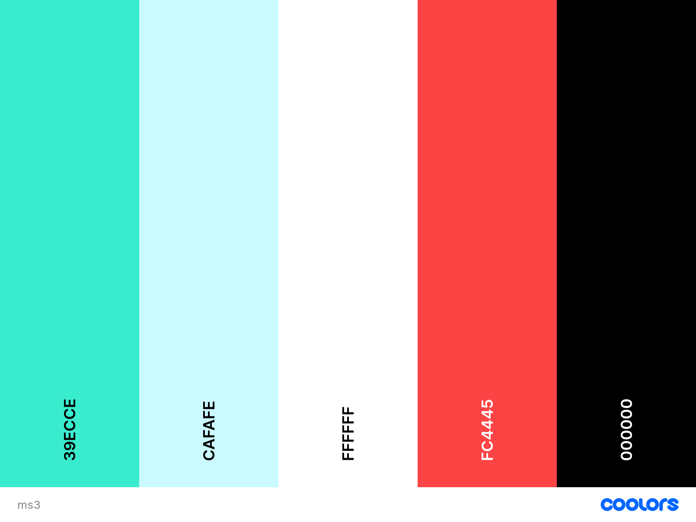

## Fan of Scran

[Link to live website](https://ms3-b.herokuapp.com/)

---

## **About**

**Milestone 3 project - Back End Development - Code institute**

Fan of Scran is a website for lovers of dining out. Users can browse reviews and upload their own reviews of their restaurant experiences

---

## Table of Contents
- [User experience (UX)](#ux)     
    - [User stories](#user-stories)
    - [Strategy](#strategy)
    - [Scope](#scope)
    - [Structure](#structure)
    - [Skeleton](#skeleton)
    - [Surface](#surface)
- [Features](#features)
- [Technologies used](#technologies-used)
- [Testing](#testing)
- [Deployment](#deployment)
- [Credits](#credits)

---

## **UX**

User experience

### **User stories**

### **As a new user I want ...**
- To understand what the sites purpose is immediatley.
- To be able to navigate to and use the registration page easily.
- To easily navigate the site once logged in and start adding reviews.

### **As a returning user I want ...**
- To be able to view my own restaurant reviews in order of when I made them.
- To edit and delete my own reviews.
- To search reviews by restaurant name, location, and user.
- To see most the latest reviews on the home page.

### **As the site owner I want ...**
- To be able to login with an admin account and delete any reviews incase they are inappropriate or offensive
- To attract new users and retain existing users to create a site with more reviews 
- Provide 404 and 500 error pages to redirect users back to the homepage
- Any external links (e.g. to our social media sites) to open in a new tab
- Provide a secure registration/login for users

---

### Strategy
The following questions were asked when developing a strategy...
- Who is the target audience, and is it culturally appropriate?
    - The target audience is anyone who loves to dine out and either document their review of this for themselves/friends/strangers or simply browse others reviews to get inspiration for where to eat next. 
- Is the technology appropriate for the user and the purpose of the website?
    - The technology is intuitive and straightforward to allow users to quickly add and browse reviews.
- How is the offering of this site different from competitors?
    - You can add a review of any restaurant in the world, even if it hasn't been reviewed before.

From the above questions, the focus for the strategy will be on the following:
- Develop a site that where the purpose is immediatley clear, and it is simple to sign up.
- Ensure the technology is straightforward and relevant to the target audience.
- Increase return users back to the site, by displaying latest reviews so they can check in regularly to see whats new.

---

### Scope
The scope of this website is to provide...
- Secure registration and login
- Straightforward navigation around the site
- Clear forms to fill out to add new reviews, with validation included.
- A search feature to allow users to filter specific reviews
- A cuisine page to allow users to browse reviews of specific cuisines

---

### Structure
The website is organised by a hierarchical tree structure. This is a standard structure used commonly, and it reduces complexity. This structure can sometimes provide problems in regards to the navigation bar when displayed on mobile devices, however including the burger toggle bar, solves this. 

#### The structure can be broken down into:
Users who do not have an account/ are not logged in
- Home page - 
- Login page - 
- Create an account page - 

Users who are logged in
- Home page - 
- Reviews page - 
- Cuisines page - 
    - British cuisine page - 
    - Chinese cuisine page - 
    - French cuisine page - 
    - Greek cuisine page - 
    - Indian cuisine page - 
    - Italian cuisine page - 
    - Mexican cuisine page - 
    - Spanish cuisine page - 
    - Other world cuisines page - 
- My reviews page -
- Add review page - 

---

### Skeleton

- A base template was created to ensure the navigation bar and footer were present on each page.
- Materialize was used throughout, this aided in ensuring all content was displayed appropriately on any device.

#### Wireframes

The original wireframes differ slightly to the final layout of the website, this is because as I was developing the site naturally some changes occurred that seemed logical to improve UX.

 

Changes made throughout development
- Added in a cuisine page, and the link to this on the navigation bar
- Altered the proportions of the layout slightly

---

### Surface

#### Colour

- #39ECCE - the background colour for nav bar and the headers of the review accordians
- #CAFAFE - the main background colour of the whole site
- #FFFFFF - used for some text and the background for the forms
- #FC4445 - used for some text, icons, and for the background of the search card
- #000000 - the text colour for most of the text throughout the website

A further colour was added that is not displayed on the colour palette above
- #F19090 - this was used for the footer and for the body of the review accordians

I chose these colours for the site as they are vibrant and bright, I was inspired by some of the american diner images included on the site, which feature neon lights and bright coloured signs.

#### Imagery

I wanted continuity with the main images across the site, each image is linked to an american diner and as mentioned, I think the colour scheme compliments this well.

Each cuisine also has an image, for which I tried to pick something that represented the specific cuisine.

For the Favicon I chose a burger image, as this fits in with the american diner theme, and of course links to the purpose of the site reviewing restaurants.

I reduced the opacity on the images within the parallax containers to allow the text to be more visible. The Parallax containers from materialize add some movement to the images when scrolling to make them stand out a bit further.

Click [here](media-sources.md) to see details of images used throughout the site.
 

#### Typography 

- 'Bebas Neue' - cursive 
    - This was the font used for the logo and headers throughout the site, it is a bold, stand-out font which fits well with the colour scheme

- Materialize
    - The font for the main body of the site is the default materialize, I did experiment with some custom fonts from google fonts, however this suited the site well.

---

## Features

### Game boards
Level 1 and level 2 feature game boards containing 12/20 cards respectivley, a timer, a moves counter, a button to start the timer and a link to the home page.
- The timer goes up and stops when all the pairs have been found.
- The moves counter increments each time a card is turned over.
- The game boards are responsive to support use of different devices

### Win message
When the player succesfully matches all of the cards on the board, the board flips over and a win message appears.
- The stats for that game are displayed.
- An option to play level 1 again or try level 2 are presented.

### Fact Cards
Interactive fact cards that have a high quality animal image on one side and the name of the animal and a fact on the other side, the user can click between each side to learn facts about each animal. The cards sit 3x4 on desktop but are responsive and shrink down to one column on most mobile devices.

### Interactive links
All of the links have a pointer change to indicate that they are links to the user

### Accessibility
- Alt attributes have been added to all images 
- Text size, font and colour were considered in a way to hopefully provide clear, easy reading.
- Wave was used to carry out testing which looked at accessibility, see [Testing](#testing) section. 

### Meta data
Meta tags are included within the head element, including a description, the author and keywords, to improve search engine optimisation. 

### 404 error page 
A custom 404 error page was added, including a link to redirect back to the home page.

### 500 error page 
A custom 404 error page was added, including a link to redirect back to the home page.

### Future features to consider

#### Style change on correct match of cards
As suggested in my feedback from family and friends, it could be a good feature to add to change the colours of the cards when a correct match is found, just to add some further interactivity to the game. This shouldn't be too complex to add in as there is already a function that checks if the two cards match, and makes the cards stay fixed and not flip back over. 

#### A table to store your scores in
To add to the competitive side to the game I think it would be good to add in a feature where you can input your name and then your score would be saved so you could play against others.

#### Further levels of the game 
Maybe up to 5 levels would draw more players to return to the site, and it is a way to add a more challenging element to the site.

#### Themed levels
Each game level could have a different theme, grouping animals together, e.g jungle, underwater, farm etc.

---