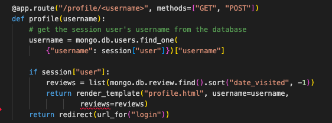
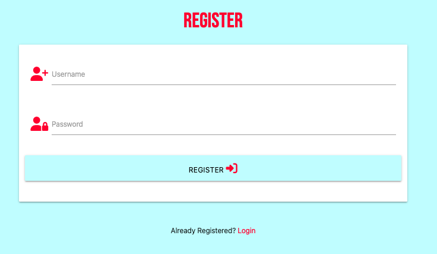

# Testing

## HTML validator
I inputted my HTML into the W3C Markup Validation service. I put each page through this. A few errors did appear on each page, mostly due to Jinja templating. An example is shown below

## CSS validator
I inputted code into the W3C validation service and no errors were found

## JS validator

I used [JSHint](https://jshint.com/).
This gave some information of the following metrics, warnings and undefined variables. The undefined variable is the $ sign, this was due to the use of JQuery. The warnings do not directly impact the functioning of the site or cause a console error.

## PEP8 Compliant 
I ensured that my Python code was PEP8 compliant, I corrected any linting errors within the IDE. I referred to [this site](https://peps.python.org/pep-0008/) to check some rules regarding indentation.

Below are some screenshots of linting errors, mainly due to indentation errors.

## Performance testing
I utilised the [Lighthouse](https://developer.chrome.com/docs/lighthouse/overview/) performance testing software.
- The results of the lighthouse testing can be seen below. 

### Home page

### Profile page

### Add a review page

## Responsiveness
- I utilised Chrome Developer tools to test responsiveness on different devices, the following devices were sucesfully tested through this.
    - iPhone SE
    - iPhone XR
    - iPhone 6/7/8
    - Samsung galaxy S8+
    - iPad Mini
    - Surface pro 7
    - Galaxy Fold
    - Nest Hub

- I tested the website on an iPhone 12 pro, an iPad 2 and a MacBook Air.

## Manual testing

### Functional testing

#### Testing elements on each page 

| Page | Element and expected action | Pass or Fail | 
| ----------- | ----------- | ----------- |
| All pages | There is a navigation bar displaying the logo "Fan of Scran" and navigation links, which all take you to the relevant page | Pass |
| All Pages | When viewing on smaller screens the navigation bar is displayed as a sidenav with a burger menu | Pass |
| All Pages | When hovering over a link the pointer changes | Pass |
| All Pages | There is a footer with social media links that all open in a new tab | Pass |
| All Pages | The website is responsive on desktop, tablet and mobile | Pass |
| Home page (Logged out) | url linked in README.md displays Fan of Scran homepage, and the Burger Favicon is visbile | Pass |
| Home page (Logged out) | There is a main title and further information about purpose of site | Pass |
| Home page (Logged out) | The register link takes you to the registration page | Pass |
| Home page (Logged out + logged in)| The review accordian opens when clicked on and displays the review correctly | Pass |
| Home page (Logged out + logged in)| The latest reviews displays the three most recent reviews in order | Pass |
| Home page (Logged in) | The add a review link takes you to the new review page | Pass |
| Home page (Logged in) | The browse reviews link takes you to the reviews page | Pass |
| Home page (Logged in) | The log out link, takes the user to the home page and displays a flash message to confirm the user has logged out. | Pass |
| Home page (Logged in) | The edit button on each review takes the user to the edit review page. A user is only allowed to edit their own reviews  | Pass |
| Home page (Logged in) | The delete button on each review opens a modal asking if the user is sure that they want to delete that review, and then if the user selects delete again, the review is succesfully deleted and a flash message confirms this to the user. A user is only allowed to delete their own reviews, apart from Admin who can delete any reviews.  | Pass |
| Login page | The login page works succesfully and only allows registered users to login | Pass |
| Login page | The password is hidden | Pass |
| Login page | The login button takes the user to their profile page, and displays a flash message to welcome them | Pass |
| Register page | The validation works for username and password length | Pass |
| Register page | The password is hidden  | Pass |
| Register page | The register button takes the user to their profile page, and displays a flash message to say their registration was successful | Pass |
| Profile page | The title of the page is the current users username  | Pass |
| Profile page | Only reviews made by the current user are displayed, in order of when they were made (most recent first)  | Pass |
| Profile page | The review accordian opens when clicked on and displays the review correctly | Pass |
| Profile page | The edit button on each review takes the user to the edit review page  | Pass |
| Profile page | The delete button on each review opens a modal asking if the user is sure that they want to delete that review, and then if the user selects delete again, the review is succesfully deleted and a flash message confirms this to the user  | Pass |
| Review page | The add a review link takes you to the new review page | Pass |
| Review page | The review accordian opens when clicked on and displays the review correctly | Pass |
| Review page | All reviews are displayed, in order of when they were made (most recent first) | Pass |
| Review page | The search function allows users to search for a review using either the restaurant name, location or rating | Pass |
| Review page | The search function button displays all relevant reviews from the users search | Pass |
| Review page | The clear search button returns the user back to all reviews | Pass |
| Review page | If there are no reviews that match the users search, there will be a message to the user explaining this | Pass |
| Review page | The edit button on each review takes the user to the edit review page. A user is only allowed to edit their own reviews   | Pass |
| Review page | The delete button on each review opens a modal asking if the user is sure that they want to delete that review, and then if the user selects delete again, the review is succesfully deleted and a flash message confirms this to the user. A user is only allowed to delete their own reviews, apart from Admin who can delete any reviews. | Pass |
| Cuisine page | Each cuisine card displayed has a relevant corresponding image and also the cuisine in the native language | Pass |
| Cuisine page | Each cuisine card when clicked on displays the relevant cuisine page | Pass |
| Specific cuisine page | The title of the page reflects the relevant cuisine | Pass |
| Specific cuisine page | If there are no reviews of that cuisine, a message will be displayed explaining this | Pass |
| Specific cuisine page | All reviews of that cuisine are displayed, in order of when they were made (most recent first)| Pass |
| Specific cuisine page | The review accordian opens when clicked on and displays the review correctly | Pass |
| Specific cuisine page | The edit button on each review takes the user to the edit review page. A user is only allowed to edit their own reviews | Pass |
| Specific cuisine page | The delete button on each review opens a modal asking if the user is sure that they want to delete that review, and then if the user selects delete again, the review is succesfully deleted and a flash message confirms this to the user. A user is only allowed to delete their own reviews, apart from Admin who can delete any reviews. | Pass |
| Add a review page | The page displays a form for the user to add a review | Pass |
| Add a review page | Each text input works and validates successfully | Pass |
| Add a review page | Each dropdown select works and validates successfully | Pass |
| Add a review page | The submit review button successfully submits the form and displays a flash message to the user to confirm this. | Pass |
| Edit review page | The page displays a form for the user to edit a review, and contains the relevant pre-filled fields within the form | Pass |
| Edit review page | Each text input works and validates successfully | Pass |
| Edit review page | Each dropdown select works and validates successfully | Pass |
| Edit review page | The edit review button successfully submits the form and displays a flash message to the user to confirm that the form has been updated | Pass |

### Browser compatibility
The following browsers were used to check compatibility with the website
- Chrome
- Safari
- Microsoft Edge

## Testing User Stories

### As a new user I want ...
- To understand what the sites purpose is immediatley.
    - The imagery, the site name and the heading all indicate the website is about food/restaurants. On Further reading it is clear the site is a restaurant review site. 

- To be able to navigate to and use the registration page easily.
    - From the initial home page there are three opportunities for a user to sign up and access the registration page. The registration page itself is straightforward and clear.

- To easily navigate the site once logged in and start adding reviews.
    - The navigation bar present once logged in is clear, and there are also opportunities when on other pages of the site to add reviews. 

### As a returning user I want ...
- To be able to view my own restaurant reviews in order of when I made them.
    - The profile page only displays reviews made by the user currently logged in and displays in order of most recently created.

- To edit and delete my own reviews.
    - A user is able to edit and delete their own reviews from any page where they can view reviews - home page, reviews page, cuisine page, and profile page. A user cannot edit or delete anothers reviews. The admin account can delete other reviews. As you can see below, when logged in as 'Bethany', I cannot edit or delete a review made by admin.

- To search reviews by restaurant name, location, and user.
    - Below are some screenshots of searches for "Red", "Newcastle", and "Excellent"

- To see the latest reviews on the home page.
    - The home page displays the three latest reviews created.

### As the website owner I want ...
- To be able to login with an admin account and delete any reviews incase they are inappropriate or offensive
    - Below is a screenshot demonstrating the ability of an admin to delete any reviews, they cannot edit reviews of other users.

    
- Provide 404 error page to redirect users back to the homepage

- Any external links (e.g. to our social media sites) to open in a new tab
    - <code>target="_blank"</code> was added to each social media link so they open in a new tab

- Provide a secure registration/login for users
    - The passwords are stored within the database as a hash so are secure
    - Users cannot type in /profile/"username" to access another users profile

- To attract new users and retain existing users to create a site with more reviews 
    - As this is just a concept and not a properly published game site, this cannot be measured. However friends and family said they like the idea and would use it.

## Identified bugs
- Bug: Rating drop down within the review form was not working
    - How I fixed it: I had two return statements within the add_review function, once I realised this and combined it into one, the drop down worked.
- Bug: Each time when trying to edit a task, the cuisine would be pre-filled in the form as British, even if that is not what was previously selected when the review was added.
    - How I fixed it: I had accidentally deleted the 'selected' component within the if statment, within the edit_review file, adding this back in fixed the issue.
- Bug: Ordering reviews by date
    - How I fixed it: Initially I tried to order the reviews by date by using <code>.sort(date_visited)</code>, however this did not work as the date_visited is a string, so it was ordering it by only day (1st, 4th, 10th etc.) and not taking into account month or year. To correct this I used <code>.sort(_id) -1</code>, which then ordered the reveiws showing the most recently made reviews first.
- Bug: Footer jumping up to middle of the page when there was not content within the main section, (e.g. if a user had not yet made any reviews, this would occur on the profile page)
    - How I fixed it: I added the following CSS from Materialize documentation.

